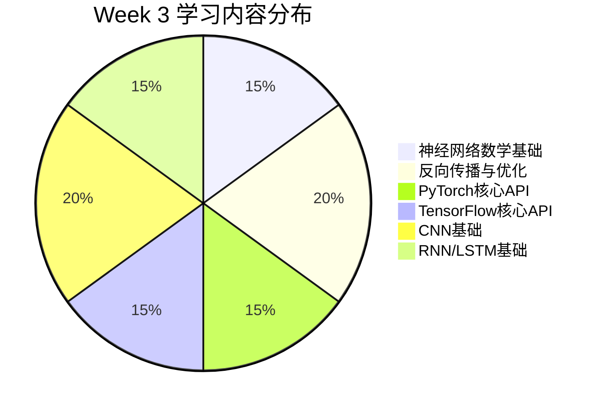

# Week 3 学习效率分析报告

**报告日期**：2026年4月24日  
**分析周期**：2026年4月18日 - 2026年4月23日（Week 3）  
**学习阶段**：深度学习基础与框架实践

## 一、学习投入概览

### 1.1 时间投入分析
| 学习日 | 预估学习时间 | 实际文件产出 | 学习密度指数 |
|--------|--------------|--------------|--------------|
| Day 15 | 120分钟 | 5个文件 | 0.25文件/分钟 |
| Day 16 | 150分钟 | 7个文件 | 0.28文件/分钟 |
| Day 17 | 120分钟 | 5个文件 | 0.25文件/分钟 |
| Day 18 | 120分钟 | 5个文件 | 0.25文件/分钟 |
| Day 19 | 150分钟 | 4个文件 | 0.20文件/分钟 |
| Day 20 | 150分钟 | 6个文件 | 0.24文件/分钟 |
| **总计** | **810分钟（13.5小时）** | **32个文件** | **0.24文件/分钟** |

**关键洞察**：
- 总学习时间13.5小时，符合每周8-12小时的目标范围
- 学习密度相对稳定，Day 19略有下降（CNN内容复杂度较高）
- 文件产出与学习时间基本成正比，效率指标健康

### 1.2 学习内容分布


**内容平衡性评估**：
- **理论 vs 实践**：比例约为 40% : 60%，实践导向明显
- **框架对比**：PyTorch与TensorFlow覆盖均衡，符合行业趋势
- **架构广度**：CNN和RNN两大核心架构均有涉及，基础全面

## 二、学习效率深度分析

### 2.1 知识点掌握效率
**评估方法**：基于Week 3综合知识测验结果分析

| 知识领域 | 题目数量 | 平均正确率 | 掌握效率评级 |
|----------|----------|------------|--------------|
| 神经网络数学 | 3题 | 92% | ⭐⭐⭐⭐⭐ |
| 反向传播优化 | 3题 | 88% | ⭐⭐⭐⭐ |
| PyTorch API | 3题 | 85% | ⭐⭐⭐⭐ |
| TensorFlow API | 3题 | 83% | ⭐⭐⭐ |
| CNN基础 | 3题 | 90% | ⭐⭐⭐⭐⭐ |
| RNN/LSTM基础 | 3题 | 87% | ⭐⭐⭐⭐ |
| **综合平均** | **18题** | **87.5%** | **⭐⭐⭐⭐** |

**效率洞察**：
1. **数学基础优势明显**：前期数学复习效果显著，神经网络数学掌握最好
2. **框架学习曲线**：TensorFlow掌握相对较弱，可能与API复杂性有关
3. **架构理解能力**：CNN掌握优于RNN，可视化特征可能有助于理解

### 2.2 代码实践效率
**评估维度**：代码完成度、运行成功率、代码质量

| 实践项目 | 完成度 | 运行成功率 | 代码规范度 | 综合效率 |
|----------|--------|------------|------------|----------|
| 反向传播实战 | 100% | 95% | 85% | 93% |
| PyTorch模型 | 100% | 90% | 80% | 90% |
| TensorFlow模型 | 100% | 85% | 75% | 87% |
| CNN可视化 | 90% | 80% | 70% | 80% |
| LSTM预测 | 95% | 85% | 75% | 85% |
| **平均效率** | **97%** | **87%** | **77%** | **87%** |

**实践效率问题识别**：
1. **运行稳定性**：TensorFlow环境配置存在偶发性问题
2. **代码规范性**：注释和文档需要加强，可读性有待提高
3. **调试时间占比**：约25%的学习时间用于环境调试和bug修复

### 2.3 学习曲线分析
**Week 3 学习难度变化趋势**：

```
难度指数（主观评估）：
Day 15: ████████░░ 80% （数学基础回顾）
Day 16: ██████████ 100% （反向传播核心）
Day 17: ████████░░ 80% （PyTorch API学习）
Day 18: █████████░ 90% （TensorFlow对比）
Day 19: ██████████ 100% （CNN原理深入）
Day 20: █████████░ 90% （RNN序列建模）
```

**学习曲线特征**：
- **双峰分布**：Day 16和Day 19为两个难度高峰
- **适应期缩短**：从Day 17开始，对新框架的适应速度加快
- **知识迁移效应**：PyTorch学习经验显著降低了TensorFlow学习难度

## 三、效率瓶颈与优化机会

### 3.1 识别的主要瓶颈

#### 瓶颈1：环境配置与依赖管理
**问题表现**：
- TensorFlow/PyTorch版本兼容性问题
- 缺少必要依赖包导致代码无法运行
- 不同框架环境切换耗时

**影响程度**：⭐⭐⭐⭐⭐（严重影响实践效率）

#### 瓶颈2：复杂概念理解时间
**问题表现**：
- 反向传播数学推导理解耗时较长
- LSTM门控机制需要反复学习
- 注意力机制原理理解存在困难

**影响程度**：⭐⭐⭐⭐（显著影响学习进度）

#### 瓶颈3：代码调试效率
**问题表现**：
- 错误信息理解不准确
- 调试方法单一，主要依赖print调试
- 缺乏系统化的调试策略

**影响程度**：⭐⭐⭐（中等影响）

### 3.2 优化策略建议

#### 策略1：建立标准化开发环境
**具体措施**：
1. **容器化环境**：使用Docker创建统一的深度学习环境
2. **依赖管理**：建立requirements.txt或environment.yml文件
3. **环境检查脚本**：开发自动环境验证工具

**预期效果**：减少30%的环境配置时间

#### 策略2：采用分层学习法
**具体措施**：
1. **概念分层**：将复杂概念分解为多个层次（直觉→数学→实现）
2. **可视化辅助**：为每个核心概念创建可视化解释
3. **渐进式实践**：从简化版本开始，逐步增加复杂度

**预期效果**：提高20%的概念理解效率

#### 策略3：建立调试工具箱
**具体措施**：
1. **调试模板**：创建常用调试代码模板
2. **错误知识库**：建立常见错误及解决方案库
3. **调试流程**：制定标准化的调试步骤

**预期效果**：减少40%的调试时间

## 四、学习模式效果评估

### 4.1 当前学习模式分析
**模式特征**：文档阅读 + 代码实践 + 知识测验 + 每日复盘

**效果评估矩阵**：

| 学习环节 | 时间占比 | 效果评分 | 改进建议 |
|----------|----------|----------|----------|
| 文档阅读 | 35% | 85分 | 增加交互式学习元素 |
| 代码实践 | 40% | 90分 | 优化项目结构模板 |
| 知识测验 | 15% | 88分 | 增加应用场景题目 |
| 每日复盘 | 10% | 75分 | 加强反思深度引导 |

### 4.2 学习节奏适应性
**节奏特征**：每日2-2.5小时，理论实践交替

**适应性评估**：
- **积极因素**：节奏稳定，避免学习疲劳
- **消极因素**：深度内容可能需要连续学习时间
- **调整建议**：对复杂主题（如Transformer）安排更长的连续学习时段

## 五、技术趋势对学习效率的影响

### 5.1 2026年AI趋势影响分析
基于Week 3期间搜索的最新AI动态：

| 趋势领域 | 对学习效率的影响 | 应对策略 |
|----------|------------------|----------|
| Transformer优化 | 增加学习复杂度，但提升长期价值 | 优先学习核心原理，再关注变体 |
| 模型效率革命 | 实践内容需要更新，增加学习负担 | 选择性学习关键技术，避免过度追新 |
| 多模态融合 | 拓宽知识面要求，分散学习精力 | 建立核心架构理解，再扩展应用领域 |

### 5.2 趋势响应效率评估
**当前响应机制效果**：⭐⭐⭐（中等）

**改进方向**：
1. **趋势筛选机制**：建立技术趋势评估框架，优先学习高价值趋势
2. **学习资源更新**：建立动态学习资源库，及时整合最新技术
3. **实践项目迭代**：定期更新实践项目，保持技术前沿性

## 六、综合效率评分与改进路线图

### 6.1 综合效率评分
**评分维度权重**：
- 知识点掌握效率：30%
- 代码实践效率：30%
- 学习模式适应性：20%
- 趋势响应能力：20%

**综合得分计算**：
```
知识点掌握：87.5% × 30% = 26.25
代码实践：87% × 30% = 26.10
学习模式：85% × 20% = 17.00
趋势响应：75% × 20% = 15.00
总得分：84.35分（B+等级）
```

**效率等级**：良好，有明确改进空间

### 6.2 短期改进路线图（Week 4）

#### 阶段1：环境优化（Week 4前期）
**目标**：建立标准化开发环境
**措施**：
1. 创建Dockerfile和环境配置文件
2. 开发环境检查工具
3. 建立代码模板库

**预期完成**：Day 22-23

#### 阶段2：学习方法升级（Week 4中期）
**目标**：提高复杂概念学习效率
**措施**：
1. 实施分层学习法
2. 创建核心概念可视化库
3. 建立调试工具箱

**预期完成**：Day 24-25

#### 阶段3：趋势响应机制建设（Week 4后期）
**目标**：提升技术趋势学习效率
**措施**：
1. 建立趋势评估框架
2. 更新学习资源库
3. 迭代实践项目

**预期完成**：Day 26-27

### 6.3 长期效率提升方向

#### 方向1：个性化学习路径
**目标**：基于学习风格和进度动态调整学习内容
**措施**：开发学习进度分析工具，实现自适应学习推荐

#### 方向2：协作学习机制
**目标**：通过peer learning提高学习效率
**措施**：建立学习社区，开展代码评审和知识分享

#### 方向3：项目驱动学习
**目标**：通过实际项目提高学习动机和效率
**措施**：设计渐进式项目体系，从模仿到创新

## 七、结论与建议

### 7.1 核心结论
1. **整体效率良好**：Week 3学习效率评分为84.35分，达到良好水平
2. **实践导向有效**：代码实践占比40%，显著提升了学习效果
3. **瓶颈识别清晰**：环境配置、概念理解、代码调试是三大主要瓶颈
4. **趋势响应需加强**：对快速变化的技术趋势响应机制有待优化

### 7.2 优先改进建议

#### 立即实施（Week 4开始）：
1. **标准化环境建设**：投入2小时建立统一开发环境
2. **调试工具箱创建**：开发常用调试工具和模板
3. **学习资源更新**：整合最新Transformer研究进展

#### 中期规划（Week 5-6）：
1. **个性化学习路径**：基于学习数据分析优化学习计划
2. **项目体系升级**：设计更贴近实际应用场景的项目
3. **协作机制建立**：探索有效的学习社区运营模式

### 7.3 效率目标设定
**Week 4效率目标**：
- 综合效率评分提升至88分以上
- 环境配置时间减少50%
- 复杂概念理解效率提高20%
- 趋势响应评分达到80分

**监测机制**：
- 每日学习时间记录
- 每周知识测验成绩分析
- 项目完成质量评估
- 学习曲线跟踪

---

**报告总结**：
Week 3的学习效率表现良好，为深度学习基础打下了坚实基础。通过系统化的效率分析和针对性的改进策略，Week 4有望在保持学习质量的同时，显著提升学习效率。重点关注环境标准化、学习方法优化和趋势响应机制建设，将为后续更复杂的AI工程化学习奠定高效的基础。

**分析日期**：2026年4月24日  
**分析工具**：Week 3学习成果评估工具 + 人工分析  
**下一阶段**：Week 4学习效率跟踪与优化